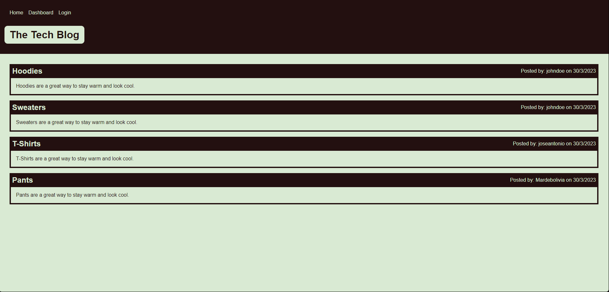

# Tech Blog

## Description

Tech Blog is a CMS-style blog site similar to a Wordpress site, where developers can publish their blog posts and comment on other developers' posts. The app is built from scratch and deployed to Heroku, following the Model-View-Controller (MVC) paradigm. It uses Handlebars.js for templating, Sequelize as the ORM, and express-session for authentication.

## Features

. User authentication (sign up, log in, log out)

. View homepage with existing blog posts

. View, create, update, and delete blog posts

. View, create, update, and delete comments

## Live Demo

Check out the live demo of the application [HERE](#http)

## Technologies Used

. Node.js

. Express.js

. Handlebars.js

. Sequelize

. MySQL2

. bcrypt

. express-session

. connect-session-sequelize

. dotenv

## Installation and Setup

1. Clone this repository to your local machine:

`https://github.com/Ishaval/CHallenge-14.git`

2. Change into the newly cloned repository's directory:

`cd your-tech-blog`

3. Install all required dependencies:

`npm install`

4. Create a .env file in the root folder and add your MySQL database credentials and session secret:
`DB_NAME=your_database_name
DB_USER=your_database_user
DB_PASSWORD=your_database_password
SESSION_SECRET=your_session_secret`

5. Run the schema.sql file in your MySQL database to create the required tables.

6. Seed the database with sample data (optional).

`npm run seed`, If you experiment some issues you can run  `mysql -uroot -p < db/schema.js`.

7. Start the application.

`npm start`

The application should now be running on http://localhost:3000

